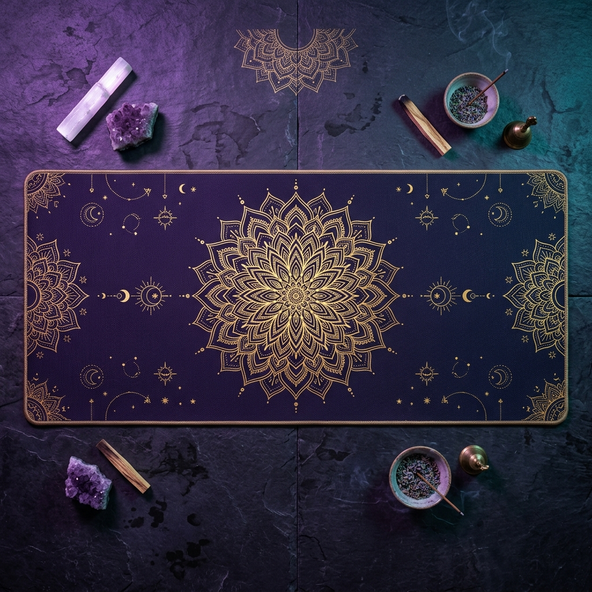

# 🌙 Sattva — E-commerce de Meditação & Espiritualidade

> **Projeto fictício desenvolvido para portfólio.** Não representa uma empresa real.



---

## 📌 Sobre o Projeto

**Sattva** é um e-commerce fictício criado como projeto de portfólio, com foco em demonstrar habilidades de desenvolvimento front-end moderno. O nome "Sattva" é um conceito do Yoga e da filosofia Hindu que significa **pureza, equilíbrio e consciência elevada** — valores que norteiam a identidade visual e o conteúdo do site.

A proposta simula uma loja online de artigos para meditação, yoga e práticas espirituais, com design premium, interações sofisticadas e experiência de usuário cuidadosamente trabalhada.

---

## 🎯 Objetivos do Projeto

Este projeto foi desenvolvido para demonstrar competências em:

- **Design UI/UX** — Identidade visual coesa, paleta de cores harmoniosa e tipografia refinada
- **Front-end moderno** — HTML5 semântico, CSS avançado e JavaScript puro sem frameworks
- **Glassmorphism & Dark Mode** — Tendências de design contemporâneo aplicadas com consistência
- **Micro-animações** — Transições e efeitos que tornam a experiência viva e dinâmica
- **Responsividade** — Layout adaptável a diferentes tamanhos de tela
- **Lógica de carrinho** — Simulação completa de adicionar/remover itens e calcular totais

---

## ✨ Funcionalidades

| Funcionalidade | Descrição |
|---|---|
| 🛒 **Carrinho de Compras** | Adicionar/remover produtos, controle de quantidade, cálculo em tempo real |
| 🔍 **Filtro por Categoria** | Filtragem de produtos por Meditação, Yoga e Cristais |
| 🖱️ **Cursor Personalizado** | Efeito de glow que acompanha o cursor do mouse (desktop) |
| 💌 **Newsletter** | Formulário de inscrição com validação de e-mail |
| 🌗 **Navbar Dinâmica** | Navbar transparente que se torna sólida ao rolar a página |
| 🃏 **Card 3D Tilt** | Efeito de inclinação 3D no card principal do Hero |
| 🔔 **Toast Notifications** | Feedback visual ao adicionar itens ao carrinho |
| 📱 **Mobile Responsivo** | Layout adaptado para dispositivos móveis |

---

## 🎨 Design System

### Paleta de Cores

| Token | Cor | Uso |
|---|---|---|
| `--primary` | `#9b6bdf` (Roxo) | CTAs, destaques, links ativos |
| `--secondary` | `#2A9D8F` (Verde-azul) | Badges, gradientes de suporte |
| `--accent` | `#E9C46A` (Dourado) | Preços, ícones especiais, logo |
| `--bg-dark` | `#0f0a1f` (Roxo escuro) | Fundo principal da página |
| `--text-main` | `#f8f7fa` | Textos principais |
| `--text-muted` | `#b4aeca` | Textos secundários |

### Tipografia

- **Headings:** [Cinzel](https://fonts.google.com/specimen/Cinzel) — Serif elegante com inspiração romana
- **Body:** [Inter](https://fonts.google.com/specimen/Inter) — Sans-serif moderna e altamente legível

### Efeitos Visuais

- **Glassmorphism** — Elementos translúcidos com `backdrop-filter: blur()`
- **Ambient Glows** — Orbs coloridas desfocadas como elementos de fundo
- **Floating Animations** — Ícones com movimento suave de levitação
- **Hover Transitions** — Transições `cubic-bezier` em todos os elementos interativos

---

## 🗂️ Estrutura de Arquivos

```
sattva/
├── index.html              # Estrutura principal do site
├── style.css               # Todos os estilos (Reset, Variáveis, Componentes)
├── script.js               # Lógica JS (produtos, carrinho, interações)
├── README.md               # Documentação do projeto
└── assets/
    └── images/
        ├── hero-yoga-mat.png          # Imagem do card principal (Hero)
        ├── category-meditacao.png     # Seção de categorias — Meditação
        ├── category-yoga.png          # Seção de categorias — Yoga
        ├── category-esoterismo.png    # Seção de categorias — Esoterismo
        ├── tibetan-bowl.png           # Produto: Tibetan Singing Bowl
        ├── yoga-mat-eco.png           # Produto: Tapete de Yoga Eco PU
        ├── japamala-amethyst.png      # Produto: Japamala 108 Contas Ametista
        ├── chakra-crystals.png        # Produto: Kit Cristais dos 7 Chakras
        ├── lotus-incense.png          # Produto: Incensário Cascata Flor de Lótus
        ├── zafu-cushion.png           # Produto: Zafu Almofada de Meditação
        ├── tarot-oracle.png           # Produto: Oráculo da Lua Tarô
        └── yoga-cork-block.png        # Produto: Bloco de Cortiça para Yoga
```

---

## 🛍️ Catálogo de Produtos (Fictício)

| Produto | Categoria | Preço |
|---|---|---|
| Tibetan Singing Bowl Original | Meditação | R$ 249,90 |
| Tapete de Yoga Eco PU Alinhamento | Yoga | R$ 329,00 |
| Japamala 108 Contas Ametista | Meditação | R$ 159,50 |
| Kit Cristais dos 7 Chakras | Cristais | R$ 89,90 |
| Incensário Cascata Flor de Lótus | Esoterismo | R$ 119,90 |
| Zafu Almofada de Meditação | Meditação | R$ 189,90 |
| Oráculo da Lua Tarô | Esoterismo | R$ 145,00 |
| Bloco de Cortiça para Yoga | Yoga | R$ 65,00 |

---

## 🚀 Como Executar

Por ser um projeto puramente estático (HTML + CSS + JS), basta abrir o arquivo `index.html` em qualquer navegador moderno. Não requer servidor, build ou instalação de dependências.

```bash
# Opção 1: Abrir direto no navegador
Clique duplo em index.html

# Opção 2: Usar um servidor local simples (recomendado)
npx serve .
# ou
python -m http.server 8000
```

---

## 🌐 Dependências Externas (CDN)

- **Google Fonts** — Cinzel & Inter
- **Remix Icons 3.5.0** — Biblioteca de ícones SVG

Todos os recursos de imagem são locais (`/assets/images/`), gerados especificamente para este projeto.

---

## 🧑‍💻 Tecnologias Utilizadas


- **HTML5** — Semântico, acessível e SEO-friendly
- **CSS3 Puro** — Custom Properties, Grid, Flexbox, Animations, Backdrop-filter
- **JavaScript Vanilla** — DOM manipulation, Event delegation, State management

---

## 📝 Contexto do Portfólio

Este projeto foi desenvolvido para demonstrar capacidade de criar interfaces modernas e complexas **sem o uso de frameworks** como React, Vue ou Angular. O foco está em:

1. **Domínio de CSS avançado** — efeitos visuais sofisticados usando apenas CSS nativo
2. **JavaScript organizado** — código estruturado e legível sem bibliotecas externas
3. **Identidade de marca** — criação de uma experiência visual consistente e memorável
4. **UX/UI** — atenção a detalhes como feedback ao usuário, animações suaves e fluxos intuitivos

---

## 👤 Autor

Desenvolvido por **Eric Pinheiro** como projeto de portfólio.

---

*"Sattva é a qualidade da mente que traz clareza, harmonia e bem-estar."*  
*— Filosofia Yoga*
